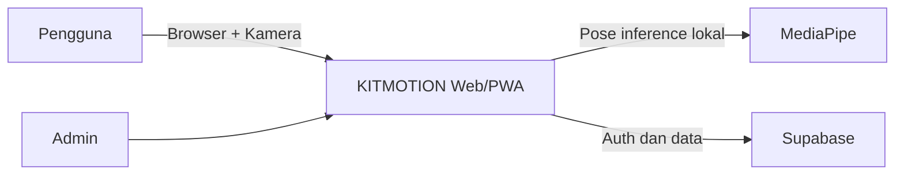
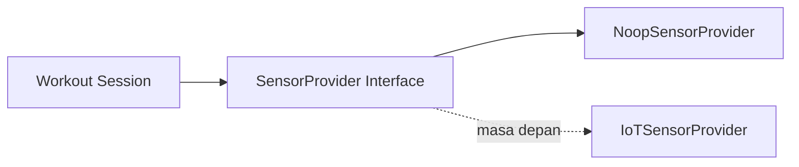
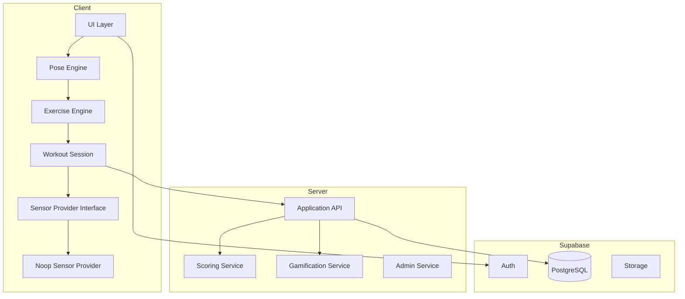
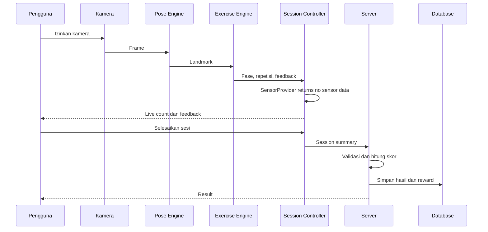

# Architecture — KITMOTION (Application-First)

> **Versi:** 2.0  
> **Fokus:** Sistem aplikasi terlebih dahulu  
> **Status IoT:** Future-ready, nonaktif

---

## 1. Prinsip Arsitektur

1. Application-first.
2. Camera-first.
3. IoT-ready, bukan IoT-active.
4. Modular monolith.
5. Privacy by default.
6. Server-authoritative.
7. Feature flag untuk fitur masa depan.
8. Tidak membuat kompleksitas yang belum dibutuhkan.
9. Tidak membuat endpoint atau database telemetry sekarang.
10. Kontrak integrasi dipersiapkan melalui interface.

---

## 2. Tech Stack

### Frontend

- Next.js App Router.
- TypeScript strict.
- Tailwind CSS.
- PWA.
- MediaPipe Pose Landmarker.
- React Hook Form.
- Schema validator.
- UI mengikuti `design.md`.

### Backend

- Next.js Server Actions / Route Handlers.
- Supabase Auth.
- Supabase PostgreSQL.
- Supabase Storage bila diperlukan.
- Supabase Realtime hanya untuk fitur aplikasi yang membutuhkan.

### IoT pada tahap sekarang

Tidak ada:

- ESP32 communication.
- Telemetry endpoint.
- Device pairing.
- Heartbeat.
- Device table.
- Raw sensor data.
- Sensor fusion.

Hanya ada:

- interface;
- type;
- no-op provider;
- feature flag;
- integration documentation.

---

## 3. Diagram Sistem Saat Ini



---

## 4. Diagram Kesiapan IoT



Pada tahap sekarang, aplikasi selalu menggunakan `NoopSensorProvider`.

---

## 5. Container Architecture



---

## 6. Aliran Data Latihan



---

## 7. Sensor Abstraction

### 7.1 Kontrak

```ts
export type SensorConnectionStatus =
  | "unavailable"
  | "disabled"
  | "connecting"
  | "connected"
  | "disconnected"
  | "error";

export type SensorSample = {
  timestampMs: number;
  acceleration?: {
    x: number;
    y: number;
    z: number;
  };
  gyroscope?: {
    x: number;
    y: number;
    z: number;
  };
};

export type SensorSessionSummary = {
  source: "none" | "iot-necklace";
  sampleCount: number;
  connectedDurationMs: number;
  stabilityIndex?: number;
  tempoVariability?: number;
};

export interface SensorProvider {
  getStatus(): SensorConnectionStatus;
  startSession(): Promise<void>;
  stopSession(): Promise<SensorSessionSummary>;
  subscribe(
    listener: (sample: SensorSample) => void
  ): () => void;
}
```

### 7.2 No-op implementation

```ts
export class NoopSensorProvider implements SensorProvider {
  getStatus(): SensorConnectionStatus {
    return "disabled";
  }

  async startSession(): Promise<void> {}

  async stopSession(): Promise<SensorSessionSummary> {
    return {
      source: "none",
      sampleCount: 0,
      connectedDurationMs: 0,
    };
  }

  subscribe(): () => void {
    return () => {};
  }
}
```

### 7.3 Feature flag

```ts
export const featureFlags = {
  iotIntegrationEnabled: false,
} as const;
```

Aturan:

- Tidak ada UI perangkat saat false.
- Tidak ada network request IoT.
- Tidak ada fake connected state.
- Tidak ada mock telemetry di production.
- Interface tidak boleh mengganggu workout kamera.

---

## 8. Modul Domain

### `auth`

- Register.
- Login.
- Reset password.
- Session.

### `profile`

- Data pengguna.
- Sekolah.
- Kelas.
- Avatar.

### `exercises`

- Katalog.
- Tutorial.
- Konfigurasi.

### `pose`

- Kamera.
- MediaPipe.
- Landmark.
- Confidence.
- Overlay.

### `exercise-engine`

- Squat.
- Jumping jack.
- Push-up.
- State machine.
- Metrics.
- Feedback.

### `workout-session`

- Timer.
- Target.
- Repetition count.
- Session lifecycle.
- SensorProvider injection.
- Finalization.

### `scoring`

- Score kamera.
- Grade.
- Versioning.

### `gamification`

- XP.
- Level.
- Badge.
- Challenge.

### `history`

- Sesi.
- Detail.
- Tren.

### `admin`

- Latihan.
- Exercise config.
- Badge.
- Challenge.
- Session review.

### `sensor-integration`

Untuk saat ini hanya:

- types;
- interface;
- no-op provider;
- feature flag;
- dokumentasi.

Tidak boleh memiliki endpoint atau kode ESP32.

---

## 9. Struktur Folder

```text
src/
├─ app/
│  ├─ (marketing)/
│  ├─ (auth)/
│  ├─ (app)/
│  │  ├─ dashboard/
│  │  ├─ exercises/
│  │  ├─ workout/
│  │  ├─ history/
│  │  └─ profile/
│  ├─ admin/
│  ├─ api/
│  │  └─ sessions/
│  └─ layout.tsx
├─ components/
│  ├─ ui/
│  ├─ layout/
│  └─ feedback/
├─ features/
│  ├─ auth/
│  ├─ profile/
│  ├─ exercises/
│  ├─ pose/
│  ├─ exercise-engine/
│  │  ├─ core/
│  │  ├─ squat/
│  │  ├─ jumping-jack/
│  │  └─ push-up/
│  ├─ workout-session/
│  ├─ scoring/
│  ├─ gamification/
│  ├─ history/
│  ├─ admin/
│  └─ sensor-integration/
│     ├─ sensor-provider.ts
│     ├─ noop-sensor-provider.ts
│     ├─ sensor-types.ts
│     └─ feature-flags.ts
├─ lib/
├─ server/
├─ config/
├─ types/
└─ tests/

supabase/
├─ migrations/
└─ seed.sql
```

Tidak boleh membuat:

```text
src/app/api/iot/
src/features/iot/
supabase telemetry tables
firmware/
```

pada fase ini.

---

## 10. Routing

### Publik

- `/`
- `/login`
- `/register`
- `/forgot-password`
- `/privacy`
- `/terms`

### Pengguna

- `/dashboard`
- `/exercises`
- `/exercises/[slug]`
- `/workout/[exerciseSlug]`
- `/history`
- `/history/[sessionId]`
- `/profile`

### Admin

- `/admin`
- `/admin/exercises`
- `/admin/challenges`
- `/admin/badges`
- `/admin/sessions`

Tidak ada route `/devices`.

---

## 11. Exercise Engine Contract

```ts
export interface ExerciseEngine {
  initialize(config: ExerciseConfig): void;
  processFrame(frame: PoseFrame): ExerciseFrameResult;
  finalize(): ExerciseSessionMetrics;
  reset(): void;
}
```

Engine tidak boleh bergantung pada:

- React.
- Supabase.
- UI.
- IoT.
- Browser DOM.

---

## 12. Workout Session Contract

```ts
export type WorkoutSessionDependencies = {
  exerciseEngine: ExerciseEngine;
  sensorProvider: SensorProvider;
  scoringService: ScoringService;
};
```

Saat ini:

```ts
const dependencies = {
  exerciseEngine,
  sensorProvider: new NoopSensorProvider(),
  scoringService,
};
```

Saat IoT tersedia, hanya provider yang diganti.

---

## 13. Database Strategy

Database saat ini menyimpan:

- profiles;
- exercises;
- exercise_versions;
- workout_sessions;
- workout_repetitions;
- session_feedback;
- user_progress;
- xp_events;
- levels;
- badges;
- user_badges;
- challenges;
- challenge_progress;
- admin logs.

Database belum menyimpan:

- devices;
- bindings;
- telemetry;
- heartbeats;
- raw samples.

Workout session boleh memiliki:

```text
sensor_source = "none"
sensor_summary = null
```

untuk menjaga kompatibilitas masa depan.

---

## 14. API

Saat ini:

- Auth melalui Supabase.
- Finalize session.
- Admin application endpoints bila diperlukan.

Tidak ada:

- `/api/iot/telemetry`
- `/api/iot/heartbeat`
- `/api/iot/pair`
- `/api/devices`

---

## 15. Environment Variables

```env
NEXT_PUBLIC_APP_URL=
NEXT_PUBLIC_SUPABASE_URL=
NEXT_PUBLIC_SUPABASE_ANON_KEY=

SUPABASE_SERVICE_ROLE_KEY=
NEXT_PUBLIC_MEDIAPIPE_MODEL_PATH=
NEXT_PUBLIC_APP_ENV=

NEXT_PUBLIC_IOT_INTEGRATION_ENABLED=false
```

Jangan menambahkan device key atau IoT secret sekarang.

---

## 16. Security

1. Frame kamera tidak dikirim.
2. Video tidak disimpan.
3. RLS aktif.
4. Service role hanya server.
5. Role admin diverifikasi server.
6. Skor final server-side.
7. Reward idempotent.
8. IoT feature flag tidak boleh mengaktifkan endpoint yang belum aman.

---

## 17. Performance

1. Lazy-load MediaPipe.
2. Turunkan resolusi jika FPS rendah.
3. Jangan simpan landmark per frame.
4. Gunakan pagination.
5. Pisahkan live state dari global state.
6. NoopSensorProvider tidak boleh membuat interval atau request.

---

## 18. Testing

### Unit

- Angle.
- Landmark normalization.
- State machine.
- Rep counting.
- Score.
- XP.
- Level.
- Badge.
- Challenge.
- NoopSensorProvider.

### Integration

- Auth.
- Finalize session.
- Duplicate session.
- XP idempotency.
- RLS.

### E2E

- Register.
- Login.
- Workout.
- Result.
- History.
- Admin minimum.

Tidak ada test telemetry pada fase ini.

---

## 19. Keputusan Arsitektur

### ADR-001

Aplikasi dibangun terlebih dahulu tanpa hardware.

### ADR-002

IoT disiapkan dengan adapter pattern.

### ADR-003

Default provider adalah no-op.

### ADR-004

Tidak ada database device sebelum hardware dan protokol final tersedia.

### ADR-005

Tidak ada endpoint IoT sebelum autentikasi perangkat dirancang dan diuji.

### ADR-006

Scoring versi sekarang hanya menggunakan kamera.

---

## 20. Batasan

AI dilarang:

1. Membuat halaman device.
2. Membuat fake device.
3. Membuat fake telemetry production.
4. Membuat tabel device.
5. Membuat endpoint telemetry.
6. Membuat firmware.
7. Menggunakan sensor pada scoring.
8. Menampilkan label connected.
9. Menambah bonus XP kalung.
10. Menunda fitur aplikasi karena IoT belum tersedia.
