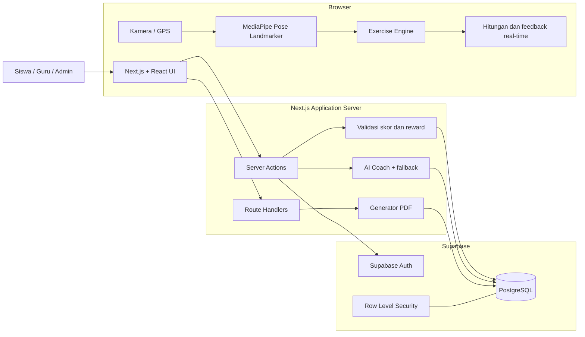
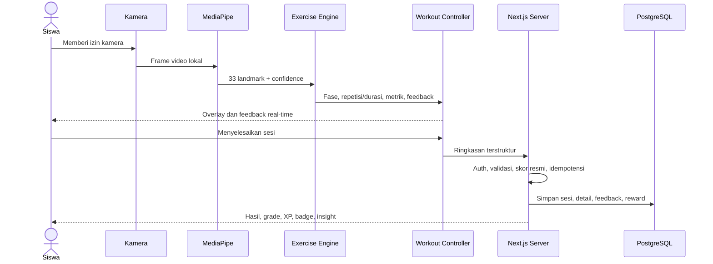
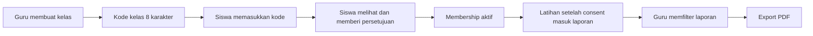

# Dokumentasi Teknis KITMOTION

> **Versi dokumen:** 3.0
> **Tanggal pembaruan:** 2 Agustus 2026
> **Jenis sistem:** Web application / Progressive Web App (PWA)
> **Status:** Application-first, camera-first, dan IoT-ready tetapi belum IoT-active
> **Pembaca:** Pengembang, pembimbing, guru, siswa, dan peserta presentasi

---

## 1. Ringkasan

KITMOTION adalah platform pembelajaran olahraga berbasis kamera yang membantu siswa berlatih dengan panduan gerakan, penghitung repetisi atau durasi valid, koreksi teknik secara real-time, skor, riwayat, dan gamifikasi. Guru dapat membuat kelas, menerima siswa melalui kode kelas dan persetujuan, memantau hasil latihan, serta mengekspor laporan PDF.

Aplikasi menggunakan kamera HP atau laptop sebagai sumber utama. MediaPipe membaca pose tubuh langsung di browser, kemudian exercise engine KITMOTION memeriksa urutan gerakan menggunakan sudut sendi, jarak relatif, simetri, tempo, dan kestabilan. Video tidak dikirim atau disimpan di server. Server hanya menerima ringkasan sesi yang sudah terstruktur.

KITMOTION saat ini tidak menggunakan kalung sensor, ESP32, MPU6050, Bluetooth, atau telemetry IoT. Struktur `SensorProvider` telah disiapkan agar perangkat dapat ditambahkan pada fase berikutnya tanpa mengubah inti aplikasi.

---

## 2. Masalah dan solusi

### Masalah

- Siswa dapat melakukan latihan tanpa mengetahui apakah tekniknya sudah benar.
- Guru sulit memantau latihan yang dikerjakan siswa di luar pengawasan langsung.
- Penilaian manual memerlukan waktu dan berisiko tidak konsisten.
- Aplikasi kebugaran umum belum tentu mengikuti kebutuhan penilaian latihan sekolah.

### Solusi KITMOTION

- Memberikan tutorial posisi awal dan tahapan gerakan.
- Membaca pose melalui kamera secara langsung.
- Menghitung hanya repetisi atau durasi yang memenuhi aturan.
- Memberikan feedback teknik selama latihan.
- Menghasilkan skor dan riwayat perkembangan.
- Menyediakan dashboard kelas dan laporan PDF untuk guru.
- Menjaga akses data siswa melalui consent dan Row Level Security.

---

## 3. Aktor sistem

| Aktor | Kemampuan utama |
|---|---|
| Siswa | Mendaftar, mengelola profil, mengikuti tutorial, melakukan latihan kamera, merekam lari GPS, memperoleh skor/XP/badge, melihat riwayat, dan bergabung ke kelas dengan persetujuan. |
| Guru | Membuat kelas dan kode, melihat anggota yang menyetujui, memfilter laporan, melihat insight kelas, mengeluarkan siswa, dan mengekspor PDF. |
| Admin | Mengelola pengguna, latihan, versi dan konfigurasi engine, kalibrasi pose, badge, challenge, sesi, provider AI, serta audit log. |

Role `admin` tidak dapat dipilih saat pendaftaran publik. Role tersebut hanya diberikan melalui proses administratif yang aman.

---

## 4. Arsitektur sistem

KITMOTION menggunakan modular monolith: satu aplikasi Next.js berisi antarmuka pengguna, logika server, dan modul domain yang terpisah. Supabase digunakan sebagai layanan autentikasi dan database PostgreSQL.



### Pembagian tanggung jawab

1. **Browser:** menampilkan UI, mengambil kamera/GPS, menjalankan MediaPipe, menghitung fase gerakan, dan memberi feedback langsung.
2. **Next.js server:** memeriksa login dan role, memvalidasi payload, menghitung hasil resmi, memberikan reward, membuat insight, dan menghasilkan PDF.
3. **Supabase Auth:** mengelola akun dan sesi autentikasi.
4. **PostgreSQL:** menyimpan profil, konfigurasi, ringkasan latihan, progres, kelas, dan laporan.
5. **RLS:** membatasi data sesuai pemilik dan hubungan guru-siswa.

---

## 5. Teknologi yang digunakan

| Teknologi | Fungsi dalam KITMOTION |
|---|---|
| Next.js 15 | Framework web, App Router, server rendering, Server Actions, dan Route Handlers. |
| React 19 | Membangun antarmuka dan state interaktif. |
| TypeScript | Menjaga tipe data dan mengurangi kesalahan implementasi. |
| Tailwind CSS | Styling responsif dengan design token proyek. |
| MediaPipe Tasks Vision | Model Pose Landmarker untuk membaca 33 landmark tubuh di browser. |
| Supabase Auth | Registrasi, login, logout, callback, dan reset password. |
| Supabase PostgreSQL | Database relasional utama. |
| Supabase RLS | Pengamanan akses data pada tingkat baris database. |
| Zod | Validasi input pada client/server. |
| React Hook Form | Pengelolaan form yang terstruktur. |
| Leaflet + OpenStreetMap | Peta rute aktivitas lari. |
| Browser Geolocation API | Mengambil titik GPS ketika tracker lari aktif. |
| pdf-lib | Membuat laporan kelas berformat PDF di server. |
| Vitest + Testing Library | Unit dan integration test. |
| Playwright | End-to-end test pada browser. |
| PWA manifest + service worker | Memungkinkan aplikasi dipasang ke layar utama. |

---

## 6. Penjelasan server

Istilah "server" dalam KITMOTION bukan berarti harus membuat komputer server fisik. Server terdiri dari dua layanan logis:

### 6.1 Application server

Kode Next.js dapat dijalankan pada Vercel atau hosting Node.js yang kompatibel. Application server bertugas untuk:

- memeriksa sesi login dan role;
- menjalankan Server Actions;
- memvalidasi ringkasan sesi dengan Zod;
- menghitung skor resmi;
- menyimpan data menggunakan kredensial server;
- memberikan XP, level, badge, dan challenge secara idempoten;
- membuat AI insight jika provider tersedia;
- menghasilkan laporan PDF guru.

### 6.2 Backend-as-a-Service Supabase

Supabase menyediakan:

- layanan autentikasi;
- database PostgreSQL;
- RLS dan policy keamanan;
- migration database;
- service-role key yang hanya boleh digunakan di server.

`SUPABASE_SERVICE_ROLE_KEY` tidak boleh memakai prefix `NEXT_PUBLIC_`, disimpan di repository, atau dikirim ke browser.

---

## 7. Cara kerja penilaian kamera



### Tahapan teknis

1. Pengguna membuka halaman latihan dan memberi izin kamera.
2. Readiness checker memastikan landmark penting terlihat dan posisi kamera sesuai.
3. MediaPipe mengubah frame menjadi koordinat landmark tubuh beserta confidence.
4. Landmark dinormalisasi dan dihaluskan untuk mengurangi noise.
5. Exercise engine membaca sudut sendi, rasio jarak, simetri, fase, dan tempo.
6. Debounce mencegah satu gerakan dihitung berkali-kali.
7. Jika landmark penting hilang atau confidence rendah, penilaian dijeda.
8. Setelah selesai, client mengirim ringkasan, bukan video.
9. Server memvalidasi jumlah repetisi, durasi, urutan, dan sub-score.
10. Server menghitung skor akhir dan menyimpan hasil secara idempoten.

### Mengapa menggunakan state machine?

Satu pose tidak cukup untuk menyatakan satu repetisi. Sistem perlu memastikan urutan posisi awal, posisi puncak/bawah, lalu kembali. State machine membuat aturan ini deterministik, dapat diuji, dan mengurangi hitungan ganda.

---

## 8. Aturan enam latihan

| Latihan | Posisi kamera dan siap | Hasil valid | Satuan |
|---|---|---|---|
| Squat | Tampak samping, berdiri tegak, seluruh tubuh terlihat. | Turun ke kedalaman yang ditentukan dengan postur terkendali, lalu kembali berdiri. | Repetisi |
| Jumping Jack | Tampak depan, kaki rapat dan tangan di samping. | Tangan cukup tinggi dan kaki cukup lebar secara simetris, lalu kembali menutup. | Repetisi |
| Push-up | Mode depan portrait/landscape didukung; mode samping landscape memberi analisis garis tubuh lebih lengkap. Mulai dari plank tinggi. | Siku mencapai kedalaman, tubuh stabil, lalu kedua lengan kembali lurus. | Repetisi |
| Sit-up | Tampak samping setinggi pinggang; telentang, lutut sekitar 90 derajat, kaki menapak. | Punggung terkendali, dada mencapai garis lutut, lalu punggung kembali lurus di matras. | Repetisi |
| Pull-up | Tampak depan setinggi dada; mulai menggantung dengan siku lurus. | Dagu menyentuh/melewati garis palang tanpa ayunan, lalu lengan kembali lurus. | Repetisi |
| Chinning-up | Tampak depan; pegangan telapak menghadap kepala, siku ditekuk, dagu di atas palang. | Timer berjalan hanya selama dagu tetap di atas palang, siku seimbang, dan badan stabil. | Detik valid |

Threshold setiap engine disimpan pada versi konfigurasi latihan. Versi scoring juga disimpan pada sesi agar perubahan algoritma pada masa depan tidak mengubah hasil lama.

---

## 9. Sistem skor

Skor akhir berada pada rentang 0-100 dan dihitung di server.

| Komponen | Bobot | Arti |
|---|---:|---|
| Form | 40% | Ketepatan postur utama. |
| Range | 25% | Kelengkapan rentang gerak. |
| Consistency | 15% | Konsistensi antar-repetisi. |
| Tempo | 10% | Kecepatan gerakan yang terkendali. |
| Stability | 10% | Kestabilan tubuh dan tracking. |

Rumus:

```text
Skor akhir =
  (Form x 0,40) +
  (Range x 0,25) +
  (Consistency x 0,15) +
  (Tempo x 0,10) +
  (Stability x 0,10)
```

| Skor | Grade |
|---:|:---:|
| 90-100 | A |
| 80-89 | B |
| 70-79 | C |
| 60-69 | D |
| Di bawah 60 | E |

Model generatif tidak menentukan skor. Skor berasal dari aturan deterministik dan dihitung ulang oleh server.

---

## 10. XP, level, badge, dan challenge

Rumus XP latihan:

```text
XP dasar = 20
Bonus skor = floor(skor / 10) x 2
Bonus target = 15 jika target tercapai
Total XP = XP dasar + bonus skor + bonus target
```

Reward memakai `idempotency_key`, sehingga request yang terkirim ulang tidak memberikan XP dua kali. Target dan toleransi dapat meningkat mengikuti level. Ketika mencapai batas level kelipatan 10, pengguna harus menyelesaikan milestone challenge sebelum rentang level berikutnya dibuka.

Badge diberikan berdasarkan pencapaian seperti sesi pertama, jumlah sesi, skor tinggi, total repetisi, dan streak. Challenge memiliki target, periode, progres, dan reward.

---

## 11. Fitur lari GPS

Selain latihan kamera, siswa dapat merekam lari menggunakan Browser Geolocation API.

Data yang dihitung:

- durasi aktif;
- jarak dengan rumus Haversine;
- pace rata-rata dan pace terbaik;
- split per kilometer;
- elevation gain;
- estimasi kalori;
- rute pada peta Leaflet/OpenStreetMap;
- XP aktivitas lari.

Titik GPS difilter berdasarkan akurasi dan kecepatan yang tidak wajar. Lokasi hanya direkam saat tracker aktif, berhenti saat dijeda/diselesaikan, lalu rute yang telah dibersihkan disimpan sebagai JSON.

---

## 12. Kelas, consent, dan laporan guru



Guru dapat memfilter laporan berdasarkan siswa, latihan, tanggal mulai, dan tanggal akhir. Laporan memuat total sesi, hasil valid, skor, durasi, level, XP, challenge, tren mingguan, kesalahan umum, serta detail aktivitas.

PDF menggunakan filter yang sedang aktif dan berisi:

- identitas kelas, tahun ajaran, guru, dan waktu pembuatan;
- ringkasan performa;
- rekap per siswa;
- grafik perkembangan mingguan;
- evaluasi kesalahan;
- tabel detail aktivitas;
- catatan privasi, footer, dan nomor halaman.

Guru hanya dapat melihat kelas miliknya. Sesi sebelum waktu consent tidak dimasukkan. Ketika siswa keluar atau dikeluarkan, akses ke laporan berikutnya dicabut.

---

## 13. AI dalam KITMOTION

KITMOTION memiliki dua penggunaan istilah AI yang berbeda:

### 13.1 Computer vision real-time

MediaPipe Pose Landmarker adalah model computer vision yang membaca landmark tubuh. Hasilnya diproses oleh exercise engine deterministik. Video tetap berada di perangkat.

### 13.2 AI coach generatif opsional

AI coach berjalan di server dan hanya menerima ringkasan terstruktur. Fitur yang tersedia:

- penjelasan hasil setelah sesi;
- rekomendasi latihan harian;
- rangkuman performa kelas untuk guru.

Provider menggunakan endpoint OpenAI-compatible. Admin dapat mengelola beberapa provider, model, prioritas, status kesehatan, dan failover. API key dienkripsi sebelum disimpan dan tidak dikirim ke browser. Output divalidasi dengan schema dan disimpan dalam cache `ai_insights`.

Jika provider belum dikonfigurasi, timeout, atau gagal, aplikasi menggunakan fallback deterministik. AI tidak dapat mengubah skor, XP, badge, challenge, atau data sumber.

---

## 14. Struktur database

Database menggunakan PostgreSQL dengan migration berurutan `0001` sampai `0017`.

| Domain | Tabel utama |
|---|---|
| Identitas | `schools`, `profiles`, `auth.users` dari Supabase Auth |
| Latihan | `exercises`, `exercise_versions`, `exercise_tutorials` |
| Hasil latihan | `workout_sessions`, `workout_repetitions`, `session_feedback` |
| Gamifikasi | `user_progress`, `xp_events`, `level_definitions`, `badges`, `user_badges`, `challenges`, `challenge_progress` |
| Milestone | `level_difficulty_configs`, `milestone_challenges`, `user_milestones`, `milestone_attempts` |
| Kelas | `classrooms`, `class_join_codes`, `class_invitations`, `class_memberships` |
| Lari | `running_sessions` |
| AI | `ai_insights`, `ai_providers` |
| Administrasi | `admin_audit_logs` |

Relasi inti:

```text
auth.users
  -> profiles
  -> workout_sessions
       -> workout_repetitions
       -> session_feedback
  -> user_progress
  -> xp_events

teacher profile
  -> classrooms
       -> class_memberships
            -> student profile
```

---

## 15. Keamanan dan privasi

1. Kamera memerlukan izin eksplisit.
2. Frame video tidak direkam, disimpan, atau dikirim ke server.
3. Landmark per frame tidak disimpan.
4. Server hanya menerima ringkasan sesi dan metrik repetisi.
5. Skor dan reward resmi diproses server-side.
6. Input divalidasi menggunakan Zod.
7. Sesi dan reward memakai kunci idempoten untuk mencegah duplikasi.
8. RLS membatasi siswa ke datanya sendiri.
9. Akses guru memerlukan kelas milik guru, membership aktif, consent, dan waktu sesi setelah consent.
10. Secret Supabase dan AI hanya tersedia di server.
11. API key provider AI disimpan terenkripsi.
12. Aplikasi bukan alat medis dan tidak memberikan diagnosis.

---

## 16. Status IoT

IoT belum aktif. Implementasi yang ada hanya:

- interface `SensorProvider`;
- `NoopSensorProvider`;
- feature flag `NEXT_PUBLIC_IOT_INTEGRATION_ENABLED=false`;
- field `sensor_source` dan `sensor_summary` yang saat ini selalu `none`/`null`;
- dokumen kontrak integrasi masa depan.

Belum ada pairing, Bluetooth, Wi-Fi telemetry, device secret, endpoint IoT, tabel perangkat, raw telemetry, atau sensor fusion. Data sensor tidak memengaruhi skor saat ini.

---

## 17. Menjalankan project secara lokal

### Prasyarat

- Node.js minimal 18.18;
- npm;
- project Supabase cloud, atau Supabase CLI dan Docker untuk database lokal.

### Instalasi

```bash
npm install
```

Salin `.env.example` menjadi `.env`, lalu isi minimal:

```dotenv
NEXT_PUBLIC_APP_URL=http://localhost:3000
NEXT_PUBLIC_SUPABASE_URL=https://PROJECT.supabase.co
NEXT_PUBLIC_SUPABASE_ANON_KEY=...
SUPABASE_SERVICE_ROLE_KEY=...
NEXT_PUBLIC_IOT_INTEGRATION_ENABLED=false
```

Konfigurasi AI bersifat opsional:

```dotenv
AI_PROVIDER=openai-compatible
AI_API_KEY=...
AI_BASE_URL=https://provider.example/v1
AI_MODEL=nama-model
AI_RESPONSE_FORMAT=json_schema
AI_TIMEOUT_MS=20000
AI_ENCRYPTION_KEY=...
```

Terapkan migration secara berurutan, kemudian jalankan:

```bash
npm run dev
```

Aplikasi lokal tersedia pada `http://localhost:3000`. Kamera dan geolocation memerlukan `localhost` atau HTTPS.

---

## 18. Deployment produksi

Arsitektur yang direkomendasikan:

```text
GitHub repository
  -> Vercel / Node-compatible hosting (Next.js)
  -> Supabase Cloud (Auth + PostgreSQL)
  -> Optional AI provider (server-to-server)
```

Langkah utama:

1. Push source code ke repository Git.
2. Import repository ke Vercel atau hosting Node.js.
3. Isi environment variable production.
4. Jalankan seluruh migration Supabase sampai `0017_sit_up_pull_up_chinning_up.sql`.
5. Atur Site URL dan redirect `/auth/callback` di Supabase Auth.
6. Gunakan custom SMTP untuk pendaftaran publik.
7. Pastikan domain menggunakan HTTPS.
8. Jalankan quality gate dan smoke test kamera pada perangkat fisik.

Nilai secret development tidak boleh disalin ke client atau dimasukkan ke source control.

---

## 19. Pengujian dan quality gate

```bash
npm run typecheck
npm run test
npm run build
npm run test:e2e
```

Area yang diuji meliputi:

- engine keenam latihan;
- readiness dan pemrosesan pose;
- smoothing, normalisasi, proyeksi, dan kamera;
- schema finalisasi sesi;
- skor, XP, level, milestone, dan reward idempoten;
- AI client, fallback, dan failover;
- GPS, jarak, pace, split, dan viewport peta;
- laporan PDF dan pagination;
- komponen UI penting.

Pengujian perangkat fisik tetap diperlukan karena performa kamera, FPS, pencahayaan, orientasi, GPS, dan izin browser berbeda pada setiap perangkat.

---

## 20. Struktur source code

```text
src/
|- app/                       halaman dan route Next.js
|- components/                komponen UI, layout, dan PWA
|- features/
|  |- auth/                   autentikasi dan form
|  |- profile/                profil pengguna
|  |- pose/                   kamera, MediaPipe, readiness, overlay
|  |- exercise-engine/        engine enam latihan
|  |- workout-session/        kontrol dan finalisasi sesi
|  |- scoring/                skor dan grade
|  |- gamification/           XP, level, badge, challenge, milestone
|  |- history/                riwayat latihan
|  |- running/                GPS, peta, metrik, dan hasil lari
|  |- classes/                kelas, laporan, dan PDF
|  |- ai-coach/               insight, cache, fallback, failover
|  |- admin/                  guard dan pengelolaan admin
|  `- sensor-integration/     kontrak IoT pasif
|- lib/                       utilitas, Supabase, AI, dan env
`- types/                     tipe database

supabase/
`- migrations/               schema, RLS, seed, dan perubahan versi
```

---

## 21. Contoh narasi presentasi

### Versi singkat 2 menit

> KITMOTION adalah aplikasi pembelajaran olahraga berbasis web dan kamera. Kamera HP atau laptop diproses langsung oleh MediaPipe di browser untuk menghasilkan 33 titik tubuh. Titik tersebut tidak langsung dianggap sebagai nilai, tetapi masuk ke exercise engine yang memeriksa urutan fase, sudut sendi, rentang gerak, simetri, tempo, dan kestabilan. Karena itu sistem dapat membedakan gerakan valid dan tidak valid. Setelah sesi selesai, hanya ringkasannya yang dikirim ke server Next.js. Server memvalidasi data, menghitung skor resmi, memberikan XP, lalu menyimpan hasil ke PostgreSQL Supabase. Guru hanya dapat melihat siswa yang sudah menyetujui kelasnya dan dapat mengekspor laporan PDF. Video tidak disimpan atau dikirim ke server. Sistem sudah menyiapkan kontrak IoT, tetapi perangkat sensor belum diaktifkan pada versi sekarang.

### Urutan demo yang disarankan

1. Login sebagai siswa.
2. Tunjukkan dashboard, level, dan rekomendasi.
3. Buka tutorial latihan dan jelaskan posisi kamera.
4. Aktifkan kamera sampai readiness menyatakan siap.
5. Lakukan satu gerakan benar dan satu gerakan salah.
6. Tunjukkan skor, feedback, dan XP.
7. Login sebagai guru.
8. Tunjukkan filter kelas dan export PDF.
9. Tutup dengan penjelasan privasi dan status IoT.

---

## 22. Pertanyaan yang mungkin diajukan juri

### Apakah KITMOTION menyimpan video siswa?

Tidak. Frame diproses lokal oleh MediaPipe di browser. Server hanya menyimpan ringkasan sesi dan metrik yang dibutuhkan.

### Apakah semua penilaian dibuat oleh AI generatif?

Tidak. Pose dibaca oleh model computer vision, tetapi hitungan dan skor ditentukan oleh rule-based exercise engine yang deterministik. AI generatif hanya membantu menjelaskan hasil dan rekomendasi.

### Bagaimana mencegah satu gerakan dihitung dua kali?

Setiap latihan menggunakan state machine, debounce beberapa frame, dan syarat kembali ke posisi awal sebelum repetisi berikutnya.

### Bagaimana mencegah siswa memalsukan skor dari browser?

Server memeriksa autentikasi, schema, konsistensi repetisi, durasi, versi latihan, dan menghitung ulang skor akhir. Client tidak menulis XP atau skor resmi secara langsung.

### Mengapa menggunakan Supabase?

Supabase menyediakan Auth, PostgreSQL, migration, dan RLS dalam satu platform. PostgreSQL tetap memberi struktur relasional yang kuat untuk sesi, kelas, progres, dan laporan.

### Bagaimana keamanan laporan guru?

Guru harus menjadi pemilik kelas, membership siswa harus aktif, consent harus tercatat, dan hanya sesi setelah consent yang boleh dilaporkan.

### Apakah aplikasi sudah memakai IoT?

Belum. Saat ini kamera adalah sumber data utama. Interface sensor hanya disiapkan untuk pengembangan masa depan.

### Apa keterbatasan sistem?

Akurasi dipengaruhi pencahayaan, jarak kamera, bagian tubuh yang tertutup, performa perangkat, orientasi kamera, dan kualitas koneksi saat model pertama kali dimuat. Sistem juga bukan alat medis.

---

## 23. Dokumen terkait

- `prd.md` - kebutuhan produk dan ruang lingkup resmi.
- `architecture.md` - keputusan arsitektur lebih rinci.
- `schema.md` - rancangan dan penjelasan database.
- `design.md` - aturan desain antarmuka.
- `docs/prd-implementation-status.md` - status implementasi PRD.
- `docs/ai-integration-plan.md` - arsitektur AI coach.
- `docs/iot-integration-contract.md` - kontrak IoT fase masa depan.
