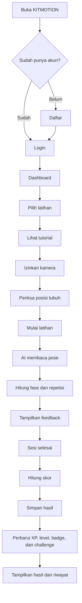

# PRD — KITMOTION (Application-First MVP)

> **Dokumen:** Product Requirements Document  
> **Versi:** 2.0  
> **Status:** Siap digunakan sebagai acuan pengembangan  
> **Fokus saat ini:** Sistem aplikasi terlebih dahulu  
> **Integrasi IoT:** Disiapkan secara arsitektural, tetapi belum diaktifkan  
> **Platform:** Web Application / Progressive Web App (PWA)  
> **Target pengguna utama:** Siswa SMA  
> **Bahasa aplikasi:** Bahasa Indonesia  
> **Catatan:** `design.md` disiapkan terpisah oleh pemilik proyek dan menjadi acuan tampilan.

---

## 1. Ringkasan Produk

KITMOTION adalah aplikasi pembelajaran olahraga berbasis web yang membantu siswa SMA melakukan latihan dengan panduan visual, analisis pose tubuh melalui kamera, penghitungan repetisi, penilaian gerakan, feedback, serta sistem gamifikasi.

Pada tahap ini, produk difokuskan sepenuhnya pada sistem aplikasi. Pengguna dapat menggunakan KITMOTION tanpa perangkat IoT.

Sistem tetap disiapkan agar pada fase berikutnya dapat dihubungkan dengan wearable sensor berbentuk kalung. Namun, pada MVP saat ini:

- belum ada koneksi perangkat;
- belum ada pairing kalung;
- belum ada pengiriman telemetry;
- belum ada pembacaan accelerometer atau gyroscope;
- belum ada pengaruh data sensor terhadap skor.

Kesiapan integrasi hanya dilakukan melalui struktur kode, interface, feature flag, dan pemisahan domain agar IoT dapat ditambahkan tanpa membongkar aplikasi utama.

---

## 2. Tujuan Produk Saat Ini

1. Membuat aplikasi olahraga yang dapat diakses melalui browser.
2. Membaca pose tubuh pengguna melalui kamera.
3. Menilai squat, jumping jack, push-up, sit-up, pull-up, serta durasi valid chinning-up.
4. Memberikan nilai dan feedback yang mudah dipahami.
5. Menyimpan hasil latihan.
6. Menampilkan level, XP, badge, dan tantangan.
7. Menampilkan riwayat perkembangan pengguna.
8. Menyiapkan fondasi teknis untuk integrasi IoT pada fase berikutnya.

---

## 3. Batasan Tahap Saat Ini

Tahap ini tidak mencakup:

1. Perakitan atau pemrograman wearable.
2. ESP32.
3. MPU6050.
4. Bluetooth.
5. Wi-Fi telemetry.
6. Pairing device.
7. QR code device.
8. Device secret.
9. Device heartbeat.
10. Sensor fusion.
11. Dashboard perangkat.
12. Penyimpanan telemetry.
13. Pengaruh kalung terhadap skor.

AI agent dilarang mengimplementasikan fitur-fitur tersebut pada tahap sekarang.

---

## 4. Visi Produk

Menjadi platform pembelajaran olahraga berbasis AI yang mudah digunakan, mampu memberi evaluasi gerakan secara real-time, dan dapat dikembangkan menjadi platform AI + IoT pada fase lanjutan.

---

## 5. Target Pengguna

### 5.1 Siswa SMA

Kebutuhan:

- Membuat akun.
- Memilih latihan.
- Melihat tutorial.
- Mengaktifkan kamera.
- Mendapatkan hitungan repetisi.
- Mendapatkan skor dan saran.
- Melihat XP, level, badge, dan riwayat.

### 5.2 Admin

Kebutuhan minimum:

- Mengelola latihan.
- Mengelola challenge.
- Mengelola badge.
- Melihat sesi latihan.
- Mengelola konfigurasi penilaian.

Admin perangkat IoT belum dibuat.

---

## 6. Platform

KITMOTION dibangun sebagai:

- Web Application.
- Progressive Web App.
- Responsif untuk Android, iPhone, tablet, dan laptop.
- Diakses melalui browser modern.
- Menggunakan HTTPS.
- Dapat ditambahkan ke layar utama.

---

## 7. Ruang Lingkup MVP Aplikasi

### 7.1 Fitur wajib

1. Landing page.
2. Registrasi.
3. Login.
4. Logout.
5. Reset password.
6. Profil pengguna.
7. Dashboard.
8. Daftar latihan.
9. Detail dan tutorial latihan.
10. Squat.
11. Jumping jack.
12. Push-up.
13. Sit-up.
14. Pull-up.
15. Chinning-up (gantung siku tekuk berbasis durasi valid).
16. Pemeriksaan kamera.
17. Pose detection.
18. Overlay landmark.
19. Penghitungan repetisi dan durasi tahan valid.
20. Penilaian gerakan.
21. Feedback real-time.
22. Timer latihan.
23. Target repetisi atau durasi.
24. Halaman hasil.
25. Riwayat latihan.
26. Statistik perkembangan sederhana.
27. XP.
28. Level.
29. Badge.
30. Tantangan harian.
31. Admin minimum.
32. PWA.
33. Error handling.
34. Loading, empty, success, dan error state.
35. Fondasi integrasi IoT nonaktif.
36. Akun guru dan dashboard guru.
37. Kelas, kode undangan, dan persetujuan siswa.
38. Laporan guru dengan filter dan rekap.
39. Target latihan mengikuti level.
40. Challenge kenaikan level pada kelipatan 10.

### 7.2 Fitur setelah MVP

1. Integrasi kalung sensor.
2. Pairing perangkat.
3. Telemetry real-time.
4. Data accelerometer dan gyroscope.
5. Sensor fusion.
6. Status baterai perangkat.
7. Leaderboard lanjutan.
8. Gerakan tambahan.
9. Rekomendasi latihan personal.
10. Ekspor laporan.

---

## 8. Alur Pengguna



---

## 9. Kebutuhan Fungsional

### 9.1 Autentikasi

- **FR-001** Pengguna dapat membuat akun.
- **FR-002** Pengguna dapat login.
- **FR-003** Pengguna dapat logout.
- **FR-004** Pengguna dapat meminta reset password.
- **FR-005** Route pengguna dilindungi.
- **FR-006** Admin memiliki route terpisah.
- **FR-007** Pendaftaran menyediakan role siswa dan guru.
- **FR-008** Role tidak dapat diubah dari client.

### 9.2 Profil

- **FR-010** Profil menyimpan nama, sekolah, kelas, dan avatar opsional.
- **FR-011** Pengguna dapat memperbarui profil.
- **FR-012** Pengguna tidak dapat mengubah role sendiri.
- **FR-013** Dashboard menampilkan level dan XP.

### 9.3 Katalog latihan

- **FR-020** Aplikasi menampilkan latihan aktif.
- **FR-021** Setiap latihan memiliki deskripsi.
- **FR-022** Setiap latihan memiliki tutorial.
- **FR-023** Setiap latihan memiliki tingkat kesulitan.
- **FR-024** Setiap latihan memiliki posisi kamera yang disarankan.
- **FR-025** Pengguna dapat memilih target latihan.

### 9.4 Kamera

- **FR-030** Aplikasi meminta izin kamera.
- **FR-031** Aplikasi menjelaskan alasan penggunaan kamera.
- **FR-032** Aplikasi mendeteksi tubuh pengguna.
- **FR-033** Aplikasi menilai apakah tubuh terlihat cukup lengkap.
- **FR-034** Aplikasi memberi panduan memperbaiki posisi kamera.
- **FR-035** Kamera dihentikan saat pengguna keluar dari halaman.
- **FR-036** Frame kamera tidak disimpan.
- **FR-037** Frame kamera tidak dikirim ke server.

### 9.5 Pose detection

- **FR-040** Aplikasi membaca landmark tubuh.
- **FR-041** Aplikasi menghitung sudut sendi.
- **FR-042** Aplikasi menilai confidence landmark.
- **FR-043** Aplikasi menampilkan overlay.
- **FR-044** Sistem menghentikan penilaian saat tracking tidak valid.
- **FR-045** Model dimuat hanya pada halaman latihan.

### 9.6 Exercise engine

- **FR-050** Setiap gerakan memiliki state machine sendiri.
- **FR-051** Repetisi dihitung setelah urutan fase valid.
- **FR-052** Sistem mencegah hitungan ganda.
- **FR-053** Sistem menghasilkan metrik per repetisi.
- **FR-054** Sistem memberikan feedback.
- **FR-055** Sistem menyimpan versi algoritma.
- **FR-056** Squat, jumping jack, push-up, sit-up, pull-up, dan chinning-up memiliki aturan penilaian masing-masing.

### 9.7 Sesi latihan

- **FR-060** Pengguna dapat memulai sesi.
- **FR-061** Sistem menampilkan timer.
- **FR-062** Sistem menampilkan jumlah repetisi.
- **FR-063** Sistem menampilkan feedback.
- **FR-064** Sistem dapat menjeda penilaian saat body tracking gagal.
- **FR-065** Pengguna dapat menyelesaikan sesi.
- **FR-066** Sesi tidak boleh tersimpan dua kali.
- **FR-067** Sistem menyimpan ringkasan sesi.

### 9.8 Penilaian

- **FR-070** Skor berada pada rentang 0–100.
- **FR-071** Skor terdiri dari form, range, consistency, tempo, dan stability berbasis kamera.
- **FR-072** Skor final divalidasi server.
- **FR-073** Sistem menampilkan grade.
- **FR-074** Sistem menampilkan saran utama.
- **FR-075** Skor tidak dihitung dari satu frame saja.

### 9.9 Gamifikasi

- **FR-080** Pengguna memperoleh XP.
- **FR-081** XP diberikan satu kali per sesi.
- **FR-082** Level diperbarui berdasarkan XP.
- **FR-083** Badge diberikan berdasarkan pencapaian.
- **FR-084** Challenge memiliki target dan waktu.
- **FR-085** Progres challenge diperbarui setelah sesi.
- **FR-086** Reward tidak boleh diberikan dua kali.
- **FR-087** Target dan toleransi latihan meningkat mengikuti level.
- **FR-088** Level berhenti pada kelipatan 10 sampai challenge milestone berhasil.
- **FR-089** Percobaan, hasil, waktu selesai, dan reward milestone disimpan secara idempoten.

### 9.10 Riwayat

- **FR-090** Pengguna melihat daftar sesi.
- **FR-091** Riwayat dapat difilter.
- **FR-092** Detail sesi menampilkan skor, repetisi, durasi, dan feedback.
- **FR-093** Aplikasi menampilkan tren sederhana.
- **FR-094** Pengguna hanya dapat melihat data miliknya.

### 9.11 Admin

- **FR-100** Admin dapat mengelola latihan.
- **FR-101** Admin dapat mengelola exercise configuration.
- **FR-102** Admin dapat mengelola badge.
- **FR-103** Admin dapat mengelola challenge.
- **FR-104** Admin dapat melihat sesi latihan.
- **FR-105** Aksi admin dicatat.

### 9.12 Guru, kelas, dan persetujuan

- **FR-106** Guru dapat membuat kelas dan kode undangan.
- **FR-107** Siswa melihat identitas guru/kelas sebelum menyetujui.
- **FR-108** Laporan hanya tersedia selama membership aktif dengan consent tercatat.
- **FR-109** Guru dapat memfilter rekap berdasarkan kelas, siswa, latihan, dan rentang tanggal.
- **FR-110** Keluar atau dikeluarkan dari kelas mencabut akses ke laporan latihan baru.

### 9.13 Kesiapan integrasi IoT

- **FR-120** Sistem memiliki interface sumber data sensor.
- **FR-121** Implementasi default menggunakan `NoopSensorProvider`.
- **FR-122** Feature flag `iotIntegrationEnabled` bernilai false.
- **FR-123** UI tidak menampilkan menu perangkat saat feature flag false.
- **FR-124** Workout session menerima sensor summary sebagai nilai opsional.
- **FR-125** Database menyediakan kolom opsional yang tidak mengharuskan data perangkat.
- **FR-126** Tidak ada endpoint IoT aktif pada fase ini.
- **FR-127** Tidak ada tabel telemetry aktif pada fase ini.
- **FR-128** Integrasi mendatang tidak boleh mengubah kontrak inti workout secara besar.

---

## 10. Aturan Gerakan

### 10.1 Squat

Fase:

1. READY
2. DESCENDING
3. BOTTOM
4. ASCENDING
5. COMPLETE

Feedback:

- Punggung terlalu membungkuk.
- Kedalaman belum cukup.
- Lutut terlalu masuk.
- Gerakan terlalu cepat.
- Posisi sudah baik.

### 10.2 Jumping Jack

Fase:

1. CLOSED
2. OPENING
3. OPEN
4. CLOSING
5. COMPLETE

Feedback:

- Tangan belum cukup tinggi.
- Kaki belum cukup terbuka.
- Gerakan belum simetris.
- Tempo belum stabil.
- Gerakan sudah baik.

### 10.3 Push-up

Fase:

1. UP
2. DESCENDING
3. DOWN
4. ASCENDING
5. COMPLETE

Feedback:

- Pinggul terlalu turun.
- Pinggul terlalu tinggi.
- Siku belum cukup menekuk.
- Tubuh belum stabil.
- Gerakan sudah baik.

Threshold final harus dikalibrasi melalui pengujian.

---

## 11. Sistem Penilaian

| Komponen | Bobot |
|---|---:|
| Ketepatan postur | 40 |
| Rentang gerak | 25 |
| Konsistensi | 15 |
| Tempo | 10 |
| Kestabilan kamera | 10 |
| **Total** | **100** |

Pada tahap aplikasi-only, seluruh komponen berasal dari kamera.

Saat IoT diaktifkan pada masa depan, bobot tempo dan kestabilan dapat menggunakan data sensor melalui versi scoring baru. Hasil sesi lama tidak boleh berubah.

---

## 12. Grade

| Skor | Grade |
|---|---|
| 90–100 | A |
| 80–89 | B |
| 70–79 | C |
| 60–69 | D |
| <60 | E |

---

## 13. XP dan Level

Contoh XP:

```text
XP dasar: 20
Bonus skor: floor(skor / 10) × 2
Bonus target: 15
Total XP = XP dasar + bonus skor + bonus target
```

IoT tidak memberikan bonus pada tahap ini.

---

## 14. Privasi

1. Video tidak disimpan.
2. Frame tidak dikirim ke server.
3. Landmark tidak disimpan per frame.
4. Hanya ringkasan latihan disimpan.
5. Pengguna harus menyetujui izin kamera.
6. Data pengguna dilindungi RLS.
7. Aplikasi bukan alat medis.
8. Feedback tidak menggunakan bahasa diagnosis.

---

## 15. Kebutuhan Nonfungsional

### Performa

- Pose detection menargetkan minimal 10 FPS pada perangkat menengah.
- Feedback muncul setelah kondisi stabil.
- Model tidak dimuat di halaman lain.

### Keamanan

- HTTPS.
- RLS.
- Server-side authorization.
- Secret hanya di server.
- Input validation.
- Admin route dilindungi.

### Aksesibilitas

- Teks mudah dibaca.
- Status tidak hanya menggunakan warna.
- Tombol dapat digunakan di ponsel.
- Error memiliki penjelasan.

### Maintainability

- TypeScript strict.
- Modular.
- State machine terpisah dari UI.
- Migration wajib.
- Test logika penting.
- IoT dipisahkan sebagai adapter masa depan.

---

## 16. Acceptance Criteria

MVP aplikasi dinyatakan selesai apabila:

1. Registrasi dan login bekerja.
2. Dashboard bekerja.
3. Tiga latihan tersedia.
4. Kamera dapat digunakan.
5. Pose detection tampil.
6. Repetisi dapat dihitung.
7. Feedback muncul.
8. Skor dihitung.
9. Sesi tersimpan.
10. History tampil.
11. XP dan level diperbarui.
12. Badge dan challenge bekerja.
13. Admin minimum bekerja.
14. PWA dapat dipasang.
15. Tidak ada menu IoT aktif.
16. Tidak ada endpoint telemetry aktif.
17. Feature flag IoT false.
18. Terdapat interface sensor untuk masa depan.
19. Build, lint, typecheck, dan test lulus.
20. Tidak ada video yang disimpan.

---

## 17. Roadmap

### Fase 1 — Aplikasi dasar

- Auth.
- Profil.
- Dashboard.
- Katalog latihan.
- PWA.
- Database.

### Fase 2 — Kamera dan pose

- Camera readiness.
- MediaPipe.
- Overlay.
- Exercise engine.

### Fase 3 — Penilaian

- Repetition counting.
- Feedback.
- Scoring.
- Result.
- History.

### Fase 4 — Gamifikasi

- XP.
- Level.
- Badge.
- Challenge.

### Fase 5 — Admin dan stabilitas

- Admin minimum.
- Testing.
- Security.
- Performance.
- Deployment.

### Fase 6 — Persiapan IoT pasif

- Sensor provider interface.
- No-op adapter.
- Feature flag.
- Optional sensor fields.
- Dokumentasi integration contract.

### Fase 7 — Integrasi IoT masa depan

Belum dikerjakan sekarang.

---

## 18. Keputusan yang Dikunci

1. Fokus saat ini adalah aplikasi.
2. Tidak ada koneksi kalung saat ini.
3. Aplikasi tetap menyiapkan interface integrasi.
4. Kamera adalah sumber data utama.
5. IoT feature flag default false.
6. Tidak ada menu perangkat saat flag false.
7. Tidak ada endpoint atau tabel telemetry sekarang.
8. Scoring saat ini hanya menggunakan kamera.
9. MVP hanya tiga gerakan.
10. `design.md` mengatur tampilan.
