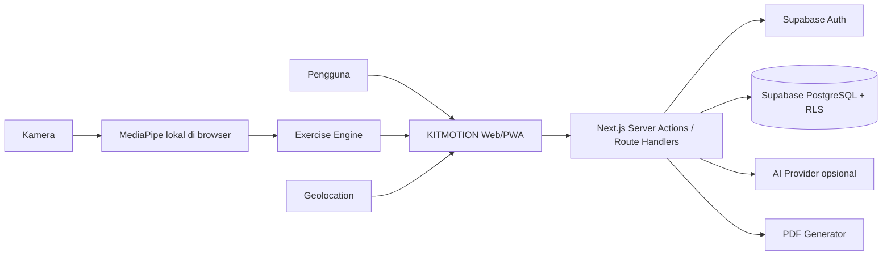
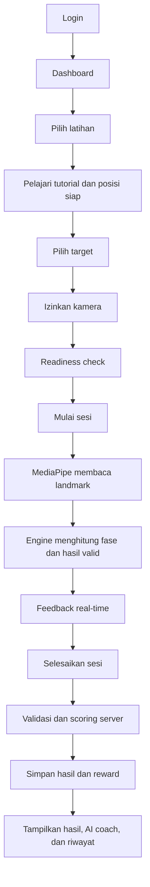
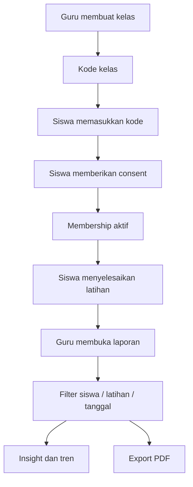

# Product Requirements Document - KITMOTION

> **Versi:** 3.0
> **Tanggal pembaruan:** 2 Agustus 2026
> **Status:** Baseline produk terimplementasi dan menjadi acuan pengembangan berikutnya
> **Platform:** Web application / Progressive Web App (PWA)
> **Fokus:** Application-first dan camera-first
> **Status IoT:** Future-ready, belum aktif
> **Bahasa aplikasi:** Bahasa Indonesia

---

## 1. Ringkasan produk

KITMOTION adalah platform pembelajaran olahraga berbasis kamera untuk siswa dan guru. Aplikasi memberikan tutorial, memeriksa kesiapan posisi tubuh, membaca landmark dengan MediaPipe, menghitung repetisi atau durasi valid, memberi feedback real-time, menghasilkan skor, menyimpan riwayat, dan memberikan reward gamifikasi.

Guru dapat membuat kelas, membagikan kode, menerima persetujuan siswa, memantau perkembangan, menggunakan insight kelas, dan mengekspor laporan PDF. Siswa juga dapat merekam aktivitas lari GPS beserta rute, jarak, pace, split, elevasi, estimasi kalori, dan XP.

Kamera adalah sumber data utama pada versi saat ini. Video dan frame diproses lokal di browser dan tidak disimpan atau dikirim ke server. IoT hanya disiapkan melalui interface dan feature flag nonaktif.

---

## 2. Latar belakang

Penilaian latihan olahraga sering dilakukan secara manual dan terbatas oleh waktu serta lokasi guru. Siswa yang berlatih mandiri juga sulit mengetahui apakah gerakannya memenuhi kriteria. KITMOTION membantu menjembatani masalah tersebut melalui penilaian pose yang transparan, feedback yang mudah dipahami, riwayat terstruktur, dan laporan kelas berbasis consent.

---

## 3. Tujuan produk

1. Membantu siswa memahami posisi awal dan teknik latihan yang benar.
2. Menghitung gerakan berdasarkan urutan fase, bukan satu pose tunggal.
3. Memberikan feedback real-time tanpa menyimpan video.
4. Menghasilkan skor yang deterministik dan tervalidasi server.
5. Mendorong konsistensi melalui XP, level, badge, challenge, dan milestone.
6. Membantu guru memantau hasil latihan siswa secara terstruktur.
7. Melindungi data siswa melalui autentikasi, RLS, consent, dan server-side authorization.
8. Mendukung aktivitas kebugaran tambahan berupa lari GPS.
9. Menyediakan AI coach opsional tanpa menyerahkan keputusan skor kepada model generatif.
10. Menyiapkan seam integrasi IoT untuk fase masa depan tanpa mengaktifkan perangkat saat ini.

---

## 4. Sasaran dan indikator keberhasilan

| Sasaran | Indikator |
|---|---|
| Latihan dapat digunakan mandiri | Tutorial, readiness, hitungan, dan feedback tersedia pada enam latihan. |
| Hasil konsisten | Engine dan scoring memiliki test serta versi konfigurasi. |
| Data dapat dipercaya | Finalisasi sesi divalidasi dan diproses server-side secara idempoten. |
| Guru dapat memantau kelas | Filter laporan, consent, tren, masalah umum, dan export PDF tersedia. |
| Privasi terjaga | Frame tidak dikirim/disimpan; akses data dibatasi RLS. |
| Aplikasi dapat digunakan lintas perangkat | UI responsif, PWA, kamera/GPS melalui secure context. |

Target performa pose adalah minimal 10 FPS pada perangkat kelas menengah dalam kondisi yang mendukung. Validasi akhir tetap memerlukan pengujian pada perangkat Android dan iPhone fisik.

---

## 5. Target pengguna

### 5.1 Siswa

- Membuat akun dan profil.
- Melihat tutorial serta aturan penilaian.
- Memilih target sesuai level.
- Melakukan latihan dengan kamera.
- Melihat hitungan, feedback, skor, grade, dan AI coach.
- Memperoleh XP, level, badge, challenge, dan milestone.
- Melihat riwayat latihan.
- Merekam lari GPS.
- Bergabung ke kelas setelah memberikan consent.

### 5.2 Guru

- Membuat dan mengelola kelas.
- Membagikan kode kelas delapan karakter.
- Melihat siswa yang menjadi anggota aktif.
- Memfilter laporan berdasarkan siswa, latihan, dan tanggal.
- Melihat ringkasan, tren, kesalahan umum, dan insight kelas.
- Mengekspor laporan PDF sesuai filter aktif.
- Mengeluarkan siswa dari kelas.

### 5.3 Admin

- Mengelola pengguna.
- Mengelola latihan, versi engine, dan konfigurasi.
- Melakukan kalibrasi pose.
- Mengelola badge dan challenge.
- Melihat sesi dan audit log.
- Mengelola provider AI, prioritas, model, health status, dan failover.

---

## 6. Ruang lingkup versi 3.0

### 6.1 Fitur yang termasuk

1. Landing page, privacy, dan terms.
2. Registrasi siswa/guru, login, logout, callback, dan reset password.
3. Profil dan avatar.
4. Dashboard siswa dengan progres dan rekomendasi.
5. Katalog serta tutorial latihan.
6. Enam exercise engine: squat, jumping jack, push-up, sit-up, pull-up, dan chinning-up.
7. Camera readiness, orientasi, MediaPipe, smoothing, overlay, dan feedback.
8. Target repetisi atau durasi sesuai tipe latihan dan level.
9. Skor, grade, XP, level, badge, challenge, streak, dan milestone.
10. Riwayat dan detail sesi.
11. Tracker lari GPS, peta, pace, split, elevasi, kalori, dan reward.
12. Kelas, kode, consent, membership, dan laporan guru.
13. Export PDF laporan kelas sesuai filter.
14. AI coach opsional dengan cache, schema validation, fallback, dan failover.
15. Admin minimum dan audit log.
16. PWA dan responsivitas lintas perangkat.
17. Fondasi IoT pasif melalui `SensorProvider`.

### 6.2 Di luar ruang lingkup saat ini

1. Firmware ESP32 atau mikrokontroler lain.
2. Sensor MPU6050 atau wearable aktif.
3. Pairing Bluetooth/Wi-Fi dan QR perangkat.
4. Endpoint, tabel, atau dashboard telemetry.
5. Penyimpanan raw sensor samples.
6. Sensor fusion kamera-IoT.
7. Pengaruh IoT terhadap skor atau XP.
8. Diagnosis medis atau rekomendasi cedera.
9. Leaderboard publik.
10. Pemrosesan atau penyimpanan video di server.

---

## 7. Arsitektur produk



Prinsip arsitektur:

1. Modular monolith.
2. Camera-first dan privacy by default.
3. Real-time pose inference berlangsung lokal di browser.
4. Final score dan reward bersifat server-authoritative.
5. Database dilindungi RLS sebagai lapisan keamanan kedua.
6. Exercise engine terpisah dari UI.
7. Konfigurasi dan scoring version disimpan agar hasil lama tetap stabil.
8. AI generatif tidak menentukan skor atau reward.
9. IoT dipisahkan melalui adapter dan nonaktif secara default.

---

## 8. Alur pengguna

### 8.1 Alur latihan siswa



### 8.2 Alur kelas guru



---

## 9. Kebutuhan fungsional

### 9.1 Autentikasi dan profil

- **FR-001** Pengguna dapat mendaftar sebagai siswa atau guru.
- **FR-002** Pengguna dapat login, logout, dan reset password.
- **FR-003** Middleware menjaga sesi autentikasi pada route terkait.
- **FR-004** Role disimpan di database dan tidak dapat diubah dari client.
- **FR-005** Role admin tidak dapat dipilih melalui pendaftaran publik.
- **FR-006** Pengguna dapat memperbarui nama, sekolah, kelas, dan avatar yang diizinkan.
- **FR-007** Dashboard diarahkan berdasarkan role.

### 9.2 Tutorial dan katalog

- **FR-010** Aplikasi menampilkan latihan aktif, deskripsi, kesulitan, dan target awal.
- **FR-011** Setiap latihan memiliki posisi awal, langkah, kesalahan umum, keselamatan, dan aturan penilaian.
- **FR-012** Tutorial ditampilkan sebelum pengguna memasuki latihan kamera.
- **FR-013** Video tutorial bersifat opsional dan memiliki fallback visual.
- **FR-014** Target latihan menyesuaikan tipe repetisi/durasi dan level.

### 9.3 Kamera dan pose

- **FR-020** Aplikasi meminta izin kamera dan menjelaskan penggunaannya.
- **FR-021** Readiness checker memeriksa landmark penting, framing, dan orientasi.
- **FR-022** MediaPipe dimuat secara lazy hanya ketika dibutuhkan.
- **FR-023** Aplikasi menampilkan overlay landmark.
- **FR-024** Landmark dinormalisasi dan dihaluskan sebelum digunakan engine.
- **FR-025** Penilaian dijeda saat confidence/tracking tidak memenuhi syarat.
- **FR-026** Stream dan resource model dibersihkan saat halaman ditutup.
- **FR-027** Frame kamera tidak disimpan dan tidak dikirim ke server.

### 9.4 Exercise engine dan sesi

- **FR-030** Setiap latihan memiliki state machine dan konfigurasi sendiri.
- **FR-031** Engine membaca sudut, jarak relatif, simetri, fase, tempo, dan kestabilan yang relevan.
- **FR-032** Debounce mencegah hitungan ganda.
- **FR-033** Repetisi dihitung setelah urutan fase valid dan kembali ke syarat awal.
- **FR-034** Chinning-up mengakumulasi hanya durasi pose valid.
- **FR-035** Engine menghasilkan feedback dengan severity dan kode terstruktur.
- **FR-036** UI menampilkan timer, target, hitungan/durasi valid, status tracking, dan feedback.
- **FR-037** Finalisasi menyimpan ringkasan sesi, detail repetisi, feedback, dan metadata.
- **FR-038** `client_session_id` mencegah sesi tersimpan dua kali.
- **FR-039** Server memeriksa konsistensi jumlah repetisi dan durasi valid.

### 9.5 Scoring

- **FR-040** Sub-score berada pada rentang 0-100.
- **FR-041** Skor terdiri dari form, range, consistency, tempo, dan stability.
- **FR-042** Server menghitung ulang final score dengan bobot resmi.
- **FR-043** Aplikasi menampilkan grade A-E.
- **FR-044** Sesi menyimpan `scoring_version` dan versi engine.
- **FR-045** Model generatif tidak dapat mengubah skor.

### 9.6 Gamifikasi

- **FR-050** Sesi valid dapat memberikan XP satu kali.
- **FR-051** Progres menyimpan total XP, level, sesi, repetisi, dan streak.
- **FR-052** Badge diberikan berdasarkan criteria yang diperiksa server.
- **FR-053** Challenge menyimpan progres dan reward secara idempoten.
- **FR-054** Target dan toleransi dapat menyesuaikan level.
- **FR-055** Level terkunci pada batas kelipatan 10 sampai milestone diselesaikan.
- **FR-056** Percobaan dan reward milestone tersimpan tanpa duplikasi.

### 9.7 Riwayat dan lari

- **FR-060** Pengguna dapat melihat daftar dan detail sesi miliknya.
- **FR-061** Riwayat latihan dapat difilter dan menampilkan tren.
- **FR-062** Detail menampilkan skor, sub-score, repetisi, feedback, durasi, dan hasil reward.
- **FR-063** Tracker lari merekam lokasi hanya setelah izin dan saat status aktif.
- **FR-064** Pengguna dapat memulai, menjeda, melanjutkan, dan menyelesaikan lari.
- **FR-065** Sistem menghitung jarak, pace, split, elevasi, kalori, dan rute.
- **FR-066** Titik GPS dengan akurasi buruk atau kecepatan tidak wajar disaring.
- **FR-067** Aktivitas lari dapat memberikan XP secara idempoten.

### 9.8 Guru, kelas, consent, dan PDF

- **FR-070** Guru dapat membuat kelas dan kode delapan karakter.
- **FR-071** Siswa dapat bergabung menggunakan kode yang aktif.
- **FR-072** Waktu consent dan keanggotaan disimpan.
- **FR-073** Guru hanya dapat mengakses kelas miliknya.
- **FR-074** Laporan hanya memasukkan siswa dengan membership aktif dan consent.
- **FR-075** Sesi sebelum consent tidak masuk laporan guru.
- **FR-076** Guru dapat memfilter berdasarkan siswa, latihan, tanggal mulai, dan tanggal akhir.
- **FR-077** Laporan menampilkan ringkasan, tren mingguan, masalah umum, level, XP, challenge, dan aktivitas.
- **FR-078** Guru dapat mengekspor PDF profesional sesuai filter aktif.
- **FR-079** PDF memiliki identitas laporan, rekap siswa, grafik, detail, footer, nomor halaman, dan pagination.
- **FR-080** Siswa dapat keluar dan guru dapat mengeluarkan siswa; akses laporan berikutnya dicabut.

### 9.9 AI coach

- **FR-090** Sistem dapat menghasilkan session coach, rekomendasi harian, dan insight kelas.
- **FR-091** AI hanya menerima ringkasan terstruktur, bukan frame/video.
- **FR-092** Respons AI divalidasi dengan schema.
- **FR-093** Insight memiliki cache dan prompt version.
- **FR-094** Jika provider gagal atau tidak tersedia, sistem menggunakan fallback deterministik.
- **FR-095** Beberapa provider dapat dikonfigurasi berdasarkan prioritas dan health status.
- **FR-096** API key provider dienkripsi dan hanya dipakai server-side.

### 9.10 Admin

- **FR-100** Admin route memerlukan pemeriksaan role server-side.
- **FR-101** Admin dapat mengelola latihan, versi, konfigurasi, badge, dan challenge.
- **FR-102** Admin dapat melihat pengguna dan sesi.
- **FR-103** Admin dapat mengelola provider AI dan mengetes kesehatan koneksi.
- **FR-104** Admin memiliki halaman kalibrasi pose.
- **FR-105** Aksi administratif penting dicatat pada audit log.

### 9.11 PWA dan IoT readiness

- **FR-110** Aplikasi memiliki manifest, icon, metadata, dan service worker production.
- **FR-111** UI responsif untuk ponsel, tablet, laptop, dan desktop.
- **FR-112** Sistem menyediakan `SensorProvider` dan `NoopSensorProvider`.
- **FR-113** Feature flag IoT bernilai false pada fase ini.
- **FR-114** Tidak ada UI perangkat, endpoint telemetry, atau tabel perangkat aktif.
- **FR-115** Server menolak sensor source selain `none` pada fase ini.

---

## 10. Aturan latihan

| Latihan | Syarat siap | Kriteria valid | Satuan |
|---|---|---|---|
| Squat | Berdiri tegak, tampak samping, seluruh tubuh terlihat. | Mencapai kedalaman, postur terkendali, lalu kembali berdiri penuh. | Repetisi |
| Jumping Jack | Berdiri tegak, tampak depan, kaki rapat, tangan di samping. | Tangan cukup tinggi dan kaki cukup lebar secara simetris, lalu kembali menutup. | Repetisi |
| Push-up | Plank tinggi; mode depan didukung, mode samping memberi analisis garis tubuh lebih lengkap. | Siku cukup menekuk, tubuh stabil, lalu lengan kembali lurus. | Repetisi |
| Sit-up | Telentang tampak samping, lutut sekitar 90 derajat, kaki menapak. | Punggung terkendali, dada mencapai garis lutut, lalu kembali lurus di matras. | Repetisi |
| Pull-up | Menggantung tampak depan, tangan selebar bahu, siku lurus. | Dagu mencapai/melewati palang tanpa ayunan, lalu lengan kembali lurus. | Repetisi |
| Chinning-up | Pegangan underhand, siku ditekuk, dagu di atas palang, badan lurus. | Timer aktif selama dagu di atas palang, siku seimbang, dan badan tidak mengayun. | Detik valid |

Nilai threshold bersifat configurable dan harus dikalibrasi melalui dataset uji berizin yang mewakili variasi tinggi badan, pakaian, pencahayaan, orientasi, dan perangkat.

---

## 11. Skor dan grade

| Komponen | Bobot |
|---|---:|
| Form | 40% |
| Range | 25% |
| Consistency | 15% |
| Tempo | 10% |
| Stability | 10% |
| **Total** | **100%** |

```text
finalScore =
  formScore x 0,40 +
  rangeScore x 0,25 +
  consistencyScore x 0,15 +
  tempoScore x 0,10 +
  stabilityScore x 0,10
```

| Rentang | Grade |
|---:|:---:|
| 90-100 | A |
| 80-89 | B |
| 70-79 | C |
| 60-69 | D |
| < 60 | E |

---

## 12. XP dan level

```text
XP dasar = 20
Bonus skor = floor(finalScore / 10) x 2
Bonus target = 15 jika target terpenuhi
Total XP sesi = XP dasar + bonus skor + bonus target
```

XP badge, challenge, milestone, dan lari dicatat sebagai event terpisah. Seluruh reward memiliki idempotency key. Level dihitung dari total XP, tetapi tidak boleh melewati `max_unlocked_level` sebelum milestone terkait selesai.

---

## 13. Data dan database

Database utama menggunakan PostgreSQL Supabase. Kelompok data:

- identitas dan autentikasi;
- katalog, tutorial, versi, dan konfigurasi latihan;
- sesi, repetisi, feedback, dan scoring version;
- progres, XP, level, badge, challenge, dan milestone;
- kelas, kode, invitation, membership, dan consent;
- aktivitas lari dan rute;
- AI insight dan provider;
- audit admin.

Semua perubahan schema dibuat melalui migration berurutan. Migration yang harus terpasang saat ini adalah `0001_init.sql` sampai `0017_sit_up_pull_up_chinning_up.sql`.

---

## 14. Privasi dan keamanan

1. Video dan frame tidak disimpan atau dikirim.
2. Landmark per frame tidak disimpan.
3. Lokasi hanya direkam saat tracker lari aktif.
4. RLS aktif pada tabel pengguna dan kelas.
5. Client tidak dapat menulis final score, XP, atau role secara langsung.
6. Service role hanya digunakan pada server setelah actor diverifikasi.
7. Payload divalidasi dengan Zod.
8. Sesi, lari, dan reward dirancang idempoten.
9. Laporan guru memerlukan ownership kelas, membership aktif, consent, dan waktu sesi yang valid.
10. Secret Supabase dan AI tidak diekspos sebagai environment variable publik.
11. API key AI yang dikelola admin disimpan terenkripsi.
12. Aplikasi bukan alat medis dan feedback tidak boleh berbentuk diagnosis.

---

## 15. Kebutuhan nonfungsional

### 15.1 Performa

- Model pose dimuat hanya pada route latihan.
- Tracking loss tidak boleh menghasilkan hitungan palsu.
- Feedback real-time harus tetap responsif pada perangkat menengah.
- PDF panjang harus menggunakan pagination.
- Query laporan dibatasi oleh kelas dan filter.

### 15.2 Keandalan

- Finalisasi sesi dan reward harus idempoten.
- Kegagalan AI tidak boleh menggagalkan penyimpanan sesi.
- Kegagalan reward lari tidak boleh menghapus rute yang berhasil disimpan.
- Versi engine dan scoring disimpan untuk kompatibilitas hasil lama.

### 15.3 Keamanan

- Production wajib HTTPS.
- Authorization dilakukan server-side dan diperkuat RLS.
- Input server divalidasi.
- Secret hanya disimpan di server.
- Admin dan teacher route memiliki role guard.

### 15.4 Aksesibilitas dan UX

- Tap target sesuai perangkat sentuh.
- Status tidak hanya dibedakan melalui warna.
- Form memiliki label dan pesan error.
- UI menyediakan loading, empty, success, error, dan not-found state.
- Reduced motion dihormati untuk media tutorial.
- Layout responsif dan tabel dapat digulir pada layar kecil.

### 15.5 Maintainability

- TypeScript strict.
- Modul domain terpisah.
- Exercise engine tidak bergantung pada UI atau IoT.
- Logika penting memiliki unit/integration test.
- Database berubah melalui migration baru, bukan mengedit production schema secara manual.

---

## 16. Acceptance criteria versi 3.0

Versi dinyatakan memenuhi baseline apabila:

1. Siswa dan guru dapat mendaftar serta login.
2. Role dan route protection bekerja.
3. Enam latihan tersedia dengan tutorial dan readiness.
4. Kamera, MediaPipe, overlay, tracking pause, dan cleanup bekerja.
5. Lima latihan repetisi dan satu latihan durasi dapat dinilai.
6. Skor 0-100 serta grade dihitung server-side.
7. Sesi, repetisi, feedback, dan scoring version tersimpan tanpa duplikasi.
8. XP, level, badge, challenge, streak, dan milestone bekerja idempoten.
9. Riwayat siswa hanya menampilkan data yang diizinkan.
10. Lari GPS dapat menyimpan rute dan metrik yang telah divalidasi.
11. Guru dapat membuat kelas dan siswa dapat memberikan consent.
12. Guru hanya melihat sesi yang memenuhi aturan ownership dan consent.
13. Filter laporan dan export PDF bekerja termasuk pagination.
14. AI coach menggunakan output tervalidasi dan memiliki fallback.
15. Admin minimum, provider AI, kalibrasi, dan audit log tersedia.
16. PWA production dapat dipasang pada secure context.
17. Tidak ada frame kamera yang disimpan atau dikirim.
18. IoT tetap nonaktif tanpa endpoint/tabel telemetry.
19. Typecheck, test, dan production build lulus.
20. Pengujian kamera dan GPS dilakukan pada perangkat fisik sebelum presentasi/produksi.

---

## 17. Roadmap

### Sudah menjadi baseline

- Autentikasi dan profil.
- Enam latihan kamera.
- Penilaian, riwayat, dan gamifikasi.
- Lari GPS.
- Learning platform guru-siswa.
- Laporan dan PDF.
- AI coach opsional dan provider failover.
- Admin, PWA, RLS, dan fondasi IoT pasif.

### Penguatan berikutnya

1. Kalibrasi threshold menggunakan pengujian perangkat dan subjek yang lebih beragam.
2. Menambahkan video tutorial lokal untuk sit-up, pull-up, dan chinning-up.
3. End-to-end test untuk alur kelas, PDF, dan perangkat mobile.
4. Observability produksi, error monitoring, rate limiting, dan backup procedure.
5. Peningkatan aksesibilitas dan evaluasi performa kamera.
6. Penyempurnaan rekomendasi AI dengan eval terukur.

### Fase masa depan

1. Gerakan tambahan.
2. Dashboard analitik sekolah yang tetap berbasis consent.
3. Leaderboard privat bila telah memiliki aturan keamanan yang jelas.
4. Integrasi IoT setelah hardware, protokol, consent, dan threat model selesai.

---

## 18. Keputusan yang dikunci

1. Kamera adalah sumber data latihan utama saat ini.
2. MediaPipe berjalan lokal di browser.
3. Video/frame tidak disimpan atau dikirim ke server.
4. Exercise engine dan scoring bersifat deterministik serta versioned.
5. Skor dan reward resmi diproses server-side.
6. AI generatif hanya menjelaskan dan merekomendasikan; tidak menentukan skor.
7. Akses guru selalu dibatasi oleh ownership, membership, consent, dan waktu sesi.
8. Export PDF mengikuti filter laporan aktif.
9. IoT feature flag tetap false sampai fase perangkat disetujui.
10. Tidak ada endpoint atau tabel telemetry pada versi ini.
11. Hasil sesi lama tidak boleh berubah ketika engine baru diterbitkan.
12. `design.md` tetap menjadi acuan visual utama.

---

## 19. Referensi dokumen

- `docs/dokumentasi-teknis-kitmotion.md` - penjelasan teknis dan bahan presentasi.
- `architecture.md` - arsitektur implementasi.
- `schema.md` - desain database.
- `design.md` - sistem desain.
- `docs/prd-implementation-status.md` - audit status implementasi.
- `docs/ai-integration-plan.md` - desain AI coach.
- `docs/iot-integration-contract.md` - kontrak IoT fase masa depan.
