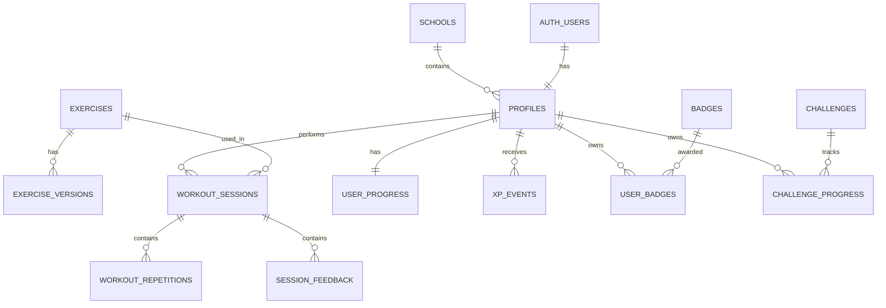

# Schema — KITMOTION (Application-First)

> **Versi:** 2.1
> **Database:** PostgreSQL melalui Supabase  
> **Fokus:** Data aplikasi  
> **IoT:** Belum diimplementasikan

---

## 1. Prinsip

1. Schema hanya mencakup fitur aplikasi yang benar-benar digunakan.
2. Tidak ada tabel perangkat atau telemetry.
3. Sesi tetap disiapkan untuk sumber sensor masa depan melalui field opsional.
4. Seluruh data user dilindungi RLS.
5. Skor dan XP tidak dapat diubah bebas oleh client.
6. Migration wajib.
7. Video dan landmark per frame tidak disimpan.

---

## 2. Enum

```sql
create type public.user_role as enum (
  'student',
  'teacher',
  'admin'
);

create type public.exercise_difficulty as enum (
  'beginner',
  'intermediate',
  'advanced'
);

create type public.workout_status as enum (
  'created',
  'active',
  'completed',
  'cancelled',
  'failed'
);

create type public.feedback_severity as enum (
  'info',
  'warning',
  'critical'
);

create type public.reward_source as enum (
  'workout',
  'challenge',
  'badge',
  'admin_adjustment'
);

create type public.challenge_period as enum (
  'daily',
  'weekly',
  'custom'
);

create type public.sensor_source as enum (
  'none',
  'iot_necklace'
);
```

`sensor_source` disediakan untuk kompatibilitas masa depan. Nilai yang digunakan sekarang selalu `none`.

---

## 3. Relasi



---

## 4. Tabel

### 4.1 `schools`

```sql
create table public.schools (
  id uuid primary key default gen_random_uuid(),
  name text not null,
  city text,
  province text,
  created_at timestamptz not null default now(),
  updated_at timestamptz not null default now(),
  constraint schools_name_not_blank
    check (length(trim(name)) > 0)
);
```

### 4.2 `profiles`

```sql
create table public.profiles (
  id uuid primary key references auth.users(id) on delete cascade,
  role public.user_role not null default 'student',
  full_name text not null,
  school_id uuid references public.schools(id) on delete set null,
  class_name text,
  avatar_path text,
  onboarding_completed boolean not null default false,
  created_at timestamptz not null default now(),
  updated_at timestamptz not null default now(),

  constraint profiles_name_not_blank
    check (length(trim(full_name)) >= 2)
);
```

### 4.3 `exercises`

```sql
create table public.exercises (
  id uuid primary key default gen_random_uuid(),
  slug text not null unique,
  name text not null,
  description text not null,
  difficulty public.exercise_difficulty not null,
  tutorial_media_url text,
  thumbnail_url text,
  camera_position text not null,
  default_target_reps integer,
  default_target_seconds integer,
  is_active boolean not null default true,
  sort_order integer not null default 0,
  created_at timestamptz not null default now(),
  updated_at timestamptz not null default now(),

  constraint exercises_slug_format
    check (slug ~ '^[a-z0-9]+(?:-[a-z0-9]+)*$')
);
```

### 4.4 `exercise_versions`

```sql
create table public.exercise_versions (
  id uuid primary key default gen_random_uuid(),
  exercise_id uuid not null references public.exercises(id) on delete cascade,
  version integer not null,
  engine_key text not null,
  scoring_version text not null,
  config jsonb not null default '{}'::jsonb,
  is_active boolean not null default false,
  created_by uuid references public.profiles(id) on delete set null,
  created_at timestamptz not null default now(),

  unique (exercise_id, version),
  unique (exercise_id, scoring_version)
);
```

---

## 5. Workout

### 5.1 `workout_sessions`

```sql
create table public.workout_sessions (
  id uuid primary key default gen_random_uuid(),
  user_id uuid not null references public.profiles(id) on delete cascade,
  exercise_id uuid not null references public.exercises(id),
  exercise_version_id uuid references public.exercise_versions(id),
  client_session_id uuid not null,
  status public.workout_status not null default 'created',

  started_at timestamptz,
  completed_at timestamptz,
  duration_seconds integer not null default 0,

  target_reps integer,
  target_seconds integer,

  total_reps integer not null default 0,
  valid_reps integer not null default 0,
  invalid_reps integer not null default 0,

  form_score numeric(5,2),
  range_score numeric(5,2),
  consistency_score numeric(5,2),
  tempo_score numeric(5,2),
  stability_score numeric(5,2),
  final_score numeric(5,2),
  grade text,

  used_camera boolean not null default true,

  sensor_source public.sensor_source not null default 'none',
  sensor_summary jsonb,

  app_version text,
  scoring_version text,
  metadata jsonb not null default '{}'::jsonb,

  created_at timestamptz not null default now(),
  updated_at timestamptz not null default now(),

  unique (user_id, client_session_id),

  constraint workout_duration_nonnegative
    check (duration_seconds >= 0),

  constraint workout_rep_counts_nonnegative
    check (
      total_reps >= 0 and
      valid_reps >= 0 and
      invalid_reps >= 0
    ),

  constraint workout_scores_valid
    check (
      (form_score is null or form_score between 0 and 100) and
      (range_score is null or range_score between 0 and 100) and
      (consistency_score is null or consistency_score between 0 and 100) and
      (tempo_score is null or tempo_score between 0 and 100) and
      (stability_score is null or stability_score between 0 and 100) and
      (final_score is null or final_score between 0 and 100)
    ),

  constraint workout_sensor_future_guard
    check (
      (sensor_source = 'none' and sensor_summary is null)
      or
      (sensor_source <> 'none')
    )
);
```

Pada tahap sekarang:

```text
sensor_source = 'none'
sensor_summary = null
```

### 5.2 `workout_repetitions`

```sql
create table public.workout_repetitions (
  id uuid primary key default gen_random_uuid(),
  session_id uuid not null references public.workout_sessions(id) on delete cascade,
  rep_number integer not null,
  started_offset_ms integer not null,
  completed_offset_ms integer not null,
  is_valid boolean not null,

  form_score numeric(5,2),
  range_score numeric(5,2),
  tempo_score numeric(5,2),
  stability_score numeric(5,2),

  metrics jsonb not null default '{}'::jsonb,
  issue_codes text[] not null default '{}',
  created_at timestamptz not null default now(),

  unique (session_id, rep_number)
);
```

### 5.3 `session_feedback`

```sql
create table public.session_feedback (
  id uuid primary key default gen_random_uuid(),
  session_id uuid not null references public.workout_sessions(id) on delete cascade,
  repetition_id uuid references public.workout_repetitions(id) on delete cascade,
  code text not null,
  severity public.feedback_severity not null,
  message text not null,
  occurrence_count integer not null default 1,
  first_offset_ms integer,
  last_offset_ms integer,
  created_at timestamptz not null default now()
);
```

---

## 6. Gamifikasi

### 6.1 `user_progress`

```sql
create table public.user_progress (
  user_id uuid primary key references public.profiles(id) on delete cascade,
  total_xp integer not null default 0,
  current_level integer not null default 1,
  max_unlocked_level integer not null default 10,
  total_sessions integer not null default 0,
  total_valid_reps integer not null default 0,
  current_streak integer not null default 0,
  longest_streak integer not null default 0,
  last_activity_date date,
  updated_at timestamptz not null default now()
);
```

### 6.2 `xp_events`

```sql
create table public.xp_events (
  id uuid primary key default gen_random_uuid(),
  user_id uuid not null references public.profiles(id) on delete cascade,
  source public.reward_source not null,
  source_id uuid,
  idempotency_key text not null,
  xp_amount integer not null,
  description text not null,
  created_at timestamptz not null default now(),

  unique (user_id, idempotency_key)
);
```

### 6.3 `level_definitions`

```sql
create table public.level_definitions (
  level integer primary key,
  name text not null,
  min_total_xp integer not null unique,
  icon text,
  created_at timestamptz not null default now()
);
```

### 6.4 `badges`

```sql
create table public.badges (
  id uuid primary key default gen_random_uuid(),
  code text not null unique,
  name text not null,
  description text not null,
  icon_url text,
  criteria jsonb not null,
  xp_reward integer not null default 0,
  is_active boolean not null default true,
  created_at timestamptz not null default now()
);
```

### 6.5 `user_badges`

```sql
create table public.user_badges (
  id uuid primary key default gen_random_uuid(),
  user_id uuid not null references public.profiles(id) on delete cascade,
  badge_id uuid not null references public.badges(id) on delete cascade,
  awarded_for_id uuid,
  awarded_at timestamptz not null default now(),

  unique (user_id, badge_id)
);
```

### 6.6 `challenges`

```sql
create table public.challenges (
  id uuid primary key default gen_random_uuid(),
  code text not null unique,
  title text not null,
  description text not null,
  period public.challenge_period not null,
  starts_at timestamptz not null,
  ends_at timestamptz not null,
  criteria jsonb not null,
  xp_reward integer not null default 0,
  is_active boolean not null default true,
  created_at timestamptz not null default now()
);
```

### 6.7 `challenge_progress`

```sql
create table public.challenge_progress (
  id uuid primary key default gen_random_uuid(),
  challenge_id uuid not null references public.challenges(id) on delete cascade,
  user_id uuid not null references public.profiles(id) on delete cascade,
  progress_value numeric not null default 0,
  target_value numeric not null,
  completed_at timestamptz,
  reward_claimed_at timestamptz,
  updated_at timestamptz not null default now(),

  unique (challenge_id, user_id)
);
```

---

## 7. Audit

### `admin_audit_logs`

```sql
create table public.admin_audit_logs (
  id uuid primary key default gen_random_uuid(),
  admin_user_id uuid references public.profiles(id) on delete set null,
  action text not null,
  entity_type text not null,
  entity_id text,
  before_data jsonb,
  after_data jsonb,
  created_at timestamptz not null default now()
);
```

---

## 8. Tabel yang Tidak Dibuat Sekarang

Jangan membuat:

- `devices`
- `device_bindings`
- `device_telemetry_latest`
- `device_telemetry_batches`
- `device_raw_samples`
- `device_heartbeats`
- `device_pairing_codes`

Tabel tersebut baru dirancang pada fase IoT setelah hardware dan protokol final tersedia.

---

## 9. Index

```sql
create index workout_sessions_user_completed_idx
  on public.workout_sessions (user_id, completed_at desc);

create index workout_sessions_exercise_idx
  on public.workout_sessions (exercise_id, completed_at desc);

create index workout_sessions_status_idx
  on public.workout_sessions (status);
```

---

## 10. RLS

Aktifkan RLS pada:

- profiles;
- workout_sessions;
- workout_repetitions;
- session_feedback;
- user_progress;
- xp_events;
- user_badges;
- challenge_progress.

Prinsip:

1. Siswa hanya membaca datanya sendiri.
2. User tidak mengubah XP sendiri.
3. User tidak mengubah role.
4. User tidak mengubah final score.
5. Finalize session melalui server.
6. Admin diverifikasi server-side.
7. Guru hanya membaca siswa dengan membership aktif dan consent tercatat.
8. Sesi guru dibatasi ke sesi yang selesai setelah waktu consent.

---

## 11. Seed

### Exercises

- squat
- jumping-jack
- push-up

### Levels

- Beginner
- Active Starter
- Intermediate
- Advanced
- Expert
- Master

### Badge

- Latihan pertama.
- Lima sesi.
- Skor 90.
- Seratus repetisi.
- Tujuh hari aktif.

Tidak ada badge penggunaan kalung pada tahap ini.

---

## 12. Retention

1. Video tidak disimpan.
2. Landmark frame tidak disimpan.
3. Ringkasan sesi disimpan.
4. Repetition metrics disimpan.
5. Sensor summary null.
6. Tidak ada raw telemetry.

---

## 13. Ekstensi Learning Platform v2.1

Migration `0007_teacher_role.sql` dan `0008_learning_platform.sql` menambahkan:

- `exercise_tutorials`: posisi awal, langkah, kesalahan umum, keselamatan, dan media opsional;
- `level_difficulty_configs`: target, skor minimum, dan toleransi per level;
- `milestone_challenges`, `user_milestones`, `milestone_attempts`: gerbang level 10/20/30 dan hasil percobaan;
- `classrooms`, `class_join_codes`, `class_invitations`, `class_memberships`: kelas, undangan, status, dan consent;
- `user_progress.max_unlocked_level`: batas level yang sudah dibuka.

Relasi akses laporan:

```text
teacher -> classrooms -> active class_memberships + consent -> student -> workout_sessions
```

Server action menggunakan service role hanya setelah memverifikasi actor. RLS tetap menjadi lapisan kedua dan mencabut akses ketika membership berubah dari `active`.
